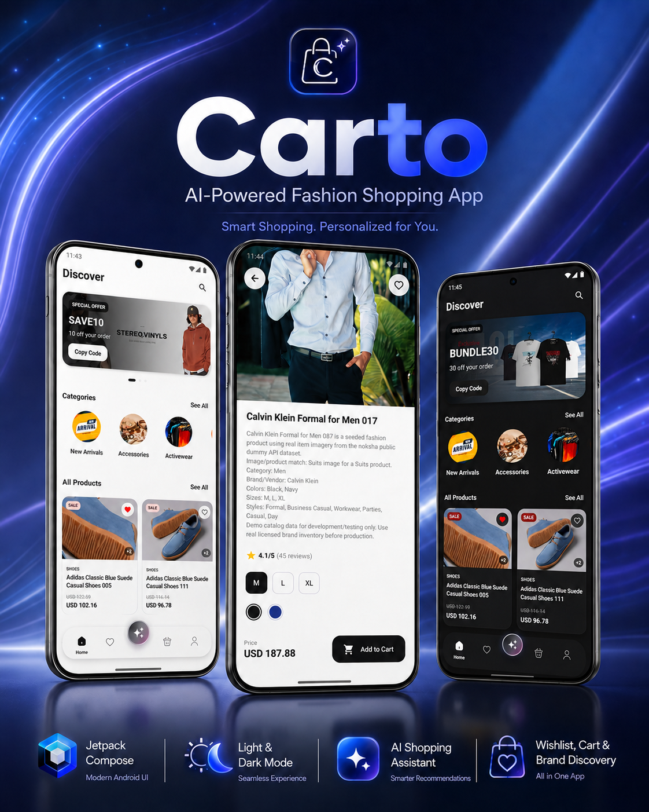
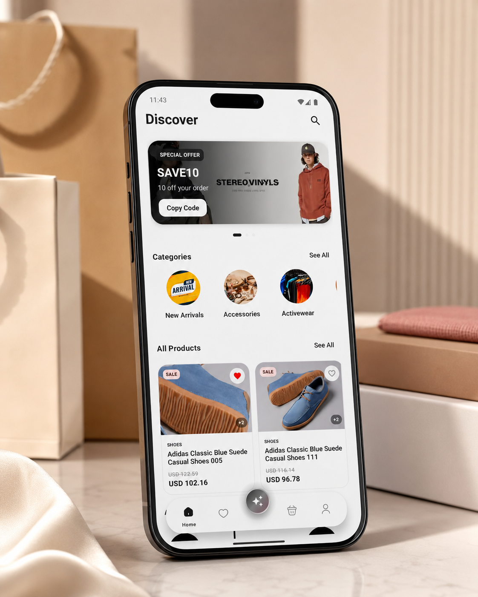
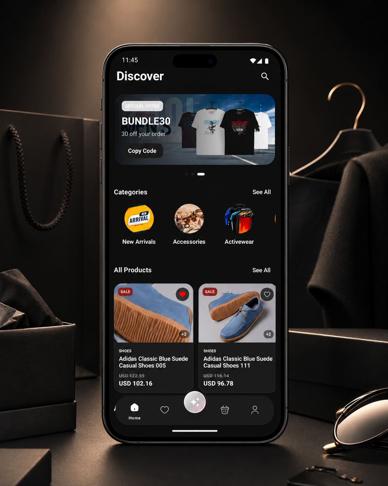
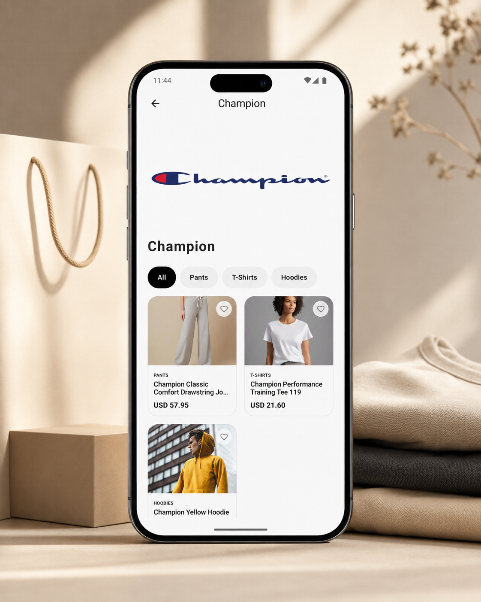
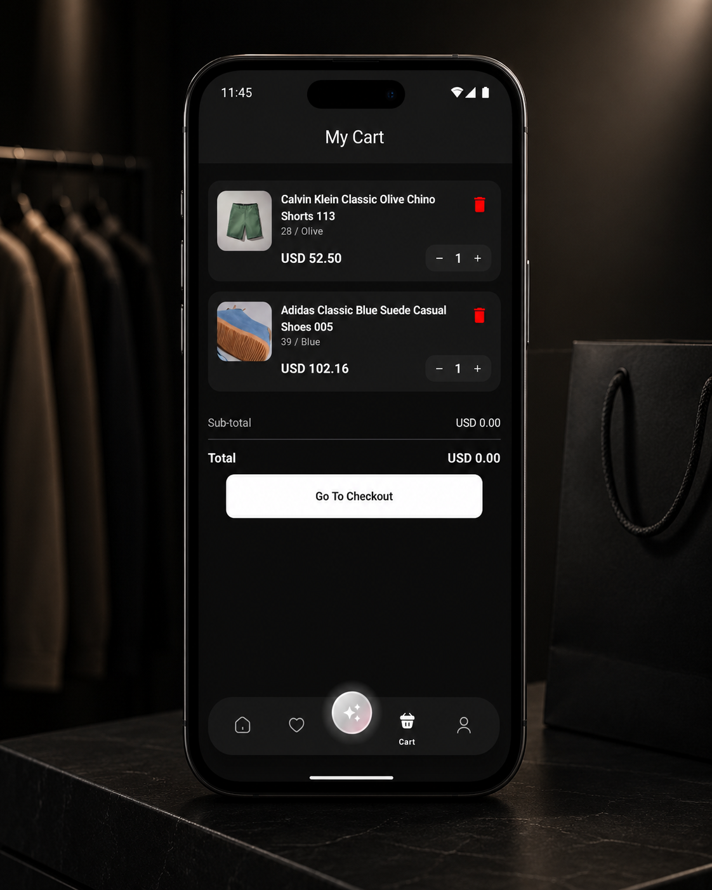

# Carto 🛍️

Carto is a modern native Android e-commerce application built for fashion shopping, product discovery, wishlist management, cart flow, AI assistance, and a polished light/dark user experience.

<p align="center">
  
</p>

## Quick Navigation

- [Overview](#overview)
- [Core Features](#core-features)
- [Architecture](#architecture)
- [Tech Stack](#tech-stack)
- [Modules](#modules)
- [Screenshots](#screenshots)
- [Setup](#setup)
- [Repository Redirection](#repository-redirection)
- [License](#license)

## Overview

Carto delivers a complete shopping workflow:

- onboarding
- home product discovery
- categories and brands
- product details
- wishlist / saved products
- cart and checkout preparation
- AI shopping assistant
- map-based address picking
- profile and account management
- light and dark mode support

The app is structured as a modular Android project, so every major feature is isolated and easier to scale, test, and maintain.

## Core Features

- **Premium onboarding experience**
- **Home screen with light and dark themes**
- **Product browsing and product details**
- **Category and brand discovery**
- **Wishlist / saved products**
- **Shopping cart flow**
- **Carto AI shopping assistant**
- **Map-based address selection**
- **Profile, settings, and order screens**
- **Clean modular architecture**

## Architecture

Carto follows a **feature-based Clean Architecture** approach.

The project is not a single huge app module where UI, network calls, database logic, and business rules are mixed together. Instead, the app is divided into feature packages and shared core layers.

### High-level structure

```text
app
├── core
│   ├── common utilities
│   ├── networking helpers
│   ├── shared models
│   ├── storage/session helpers
│   └── reusable app-level logic
│
├── feature
│   ├── home
│   ├── brand
│   ├── search
│   ├── favorite
│   ├── shopping_cart
│   ├── product_details
│   ├── profile
│   ├── map
│   ├── addresses
│   ├── ai_integration
│   ├── settings
│   └── other isolated features
│
├── navigation
│   └── app navigation graph and route handling
│
└── ui.theme
    └── shared theme, colors, typography, and design tokens
```

### Typical feature structure

Most features follow this internal layout:

```text
feature/<feature_name>
├── data
│   ├── remote data sources
│   ├── local data sources
│   ├── DTOs
│   ├── mappers
│   └── repository implementations
│
├── domain
│   ├── models
│   ├── repository contracts
│   └── use cases
│
└── presentation
    ├── screens
    ├── ViewModels
    ├── UI state
    └── events/actions
```

### Layer responsibilities

| Layer | Responsibility |
|---|---|
| `presentation` | Jetpack Compose screens, ViewModels, UI state, user actions |
| `domain` | Business rules, use cases, repository contracts, domain models |
| `data` | API calls, local database/cache, DTOs, mappers, repository implementations |
| `core` | Shared utilities, base models, networking/session helpers, common logic |
| `navigation` | App routes, screen transitions, argument passing |
| `ui.theme` | Colors, typography, shapes, light/dark theme definitions |

### Data flow

```text
User Action
   ↓
Compose Screen
   ↓
ViewModel
   ↓
Use Case
   ↓
Repository Interface
   ↓
Repository Implementation
   ↓
Remote API / Local Database
   ↓
Mapper
   ↓
Domain Model
   ↓
UI State
   ↓
Compose UI
```

### Why this architecture matters

- Features are easier to maintain.
- Business logic is separated from UI.
- DTOs do not leak into screens.
- Repositories can be mocked or replaced in tests.
- ViewModels focus on state management.
- Local and remote data sources stay isolated.
- New features can be added without breaking unrelated modules.

## Tech Stack

- **Language:** Kotlin
- **UI:** Jetpack Compose
- **Architecture:** Clean Architecture + feature-based modular structure
- **Dependency Injection:** Hilt
- **Networking:** Retrofit / GraphQL
- **Backend integrations:** Shopify + Firebase
- **Local persistence:** Room / DataStore
- **Concurrency:** Kotlin Coroutines / Flow
- **Image loading:** Coil
- **Maps:** Map-based address selection flow
- **Theme:** Light and dark mode

## Modules

### Main feature modules

```text
addresses
ai_integration
ai_widget
brand
currency
favorite
forgetpassword
home
home_widget
login
map
on_boarding
orderdetails
orderhistory
payment
product_details
product_reviews
profile
register
search
settings
shopping_cart
splash.presentation
```

## Screenshots

### Home - Light Mode



### Home - Dark Mode



### More Screens

| Screen | Preview |
|---|---|
| Onboarding |  |
| Saved / Wishlist |  |
| Product Details |  |
| Carto AI |  |
| Brand Page |  |
| Cart |  |
| Map / Address |  |
| Profile |  |

## Setup

```bash
git clone <your-repository-url>
cd carto
```

Open the project in **Android Studio**, sync Gradle, then run it on an emulator or a real Android device.

## Repository Redirection

This repository is for the **Carto Android mobile application**.

If you also maintain the **Shopify dashboard / importer / catalog backend**, keep it in a separate repository and add its link here.

Suggested repository links:

```text
Mobile App: Carto Android Client
Dashboard / Backend: Carto Shopify Dashboard
```

Replace these placeholders with your real repository URLs before publishing.

## License

This project is licensed under the **MIT License**.

See the [LICENSE](LICENSE) file for details.
